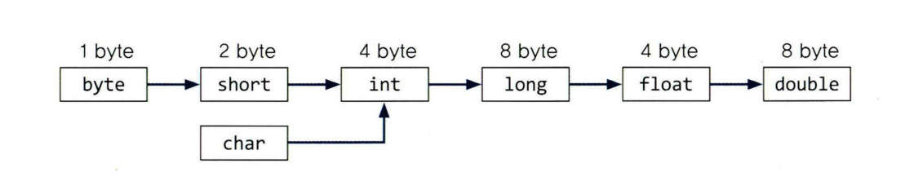

## 기본 타입

- 기본타입 : byte, short, int, long
- 부동 소수점 타입 : float, double
- 문자열 인코딩 사용하는 문자 타입 : char
- 참 거짓을 나타내는 타입 : boolean

### 부호 있는 정수 타입

| 타입 |저장 공간| 범위                                    |
|---|---|---------------------------------------|
| byte |1바이트| -128~127                              | 
| short |2바이트| -32,768~32,767                        |
| int |4바이트| -2,147,483,648~2,147,483,647(20억이 넘음) |
| long |8바이트| -9.223,372,036,854,775,808~9,223,372,036,854,775,807|

## Integer 타입
>An integer literal may be expressed in decimal (base 10), hexadecimal (base 16), octal (base 8), or binary (base 2).
> An integer literal is of type long if it is suffixed with an ASCII letter L or l (ell); otherwise it is of type int (§4.2.1).
> The suffix L is preferred, because the letter l (ell) is often hard to distinguish from the digit 1 (one).
> Underscores are allowed as separators between digits that denote the integer.
> In a hexadecimal or binary literal, the integer is only denoted by the digits after the 0x or 0b characters and before any type suffix. Therefore, underscores may not appear immediately after 0x or 0b, or after the last digit in the numeral.
> In a decimal or octal literal, the integer is denoted by all the digits in the literal before any type suffix. Therefore, underscores may not appear before the first digit or after the last digit in the numeral. Underscores may appear after the initial 0 in an octal numeral (since 0 is a digit that denotes part of the integer) and after the initial non-zero digit in a non-zero decimal literal.
>A decimal numeral is either the single ASCII digit 0, representing the integer zero, or consists of an ASCII digit from 1 to 9 optionally followed by one or more ASCII digits from 0 to 9 interspersed with underscores, representing a positive integer.

자바 영문에 보면 정수 리터럴은 ASCII 문자 L 또는 l (ell)로 접미사가 붙은 경우 유형이 long. 그렇지 않으면 int 유형입니다.

```java
jshell> int i = 100000;
i ==> 100000

jshell> long l = 5000000000;
|  Error:
|  integer number too large
|  long l = 5000000000;
|           ^

jshell> long l = 50000000000l;
l ==> 50000000000

```
정수 유형의 리터럴은 디폴트로 int 유형을 가져서 긴 리터널을 만들려면 "l"을 추가합니다.

### 부동 소수점 타입

| 타입     |저장 공간| 범위                                    |
|--------|---|-----|
| float  |4바이트| 약 +-3.40282347E+38F(유효자릿수 6~7)| 
| double |8바이트| 약 +-1.79769313486231570E+308(유효자릿수 15)|

float는 저장할 부동소수점 수가 많을 때만 사용합니다.

부동소수점 수는 금융 계산에는 적합하지 않습니다. 금융 계산은 반올림 오류를 용납하지 않기 때문입니다.
정밀도로 반올림 오류가 없는 정확한 숫자 계산이 필요할 때는 1.4.6 큰 숫자에서 설명하는 BigDecimal 클래스를 사용합니다.

### char 타입

char 타입은 자바가 사용하는 UTF-16 문자 인코딩의 ‘코드 유닛'을 나타냅니다.

char 타입은 자주 사용하지 않습니다.

### boolean 타입

boolean 타입 값은 false 와 true 두 개뿐입니다.


### 형변환 연산자

> 형변환이란, 변수 또는 상수의 타입을 다른 타입으로 변환하는것

괄호( )는 '캐스트 연산자' 또는 '형변환 연산자'라 하며, 형변환을 '캐스팅'이라고 합니다.

```java
double d = 85.4;
int score = (int)d;
```
```java
int score = (int)d ; -> int score = (int)85.4; -> int score = 85;
```

```java
class Ex3_5 {
    public static void main(String[] args) {
        double d = 85.4;
        int score = (int) d;
        System.out.println("score=" + score);
        System.out.println("d=" + d);
    }
    // score = 85;
    // d = 85.4
}
```
### 자동 형변환
서로 다른 타입간의 대입이나 연산을 할 때, 먼저 형변환으로 타입을 일치시키는 것이 원칙입니다. 그렇짐나 편의상의 이유로 형변환을 생략할 수 있습니다.


화살표 방햐으로의 변환, 왼쪽에서 오른쪽으로의 변환으로 형변환 연산자를 사용하지 않아도 자동 형변환이 되며, 그 반대 방향으로 변환은 반드시 형변환 연산자를 써야 합니다.
