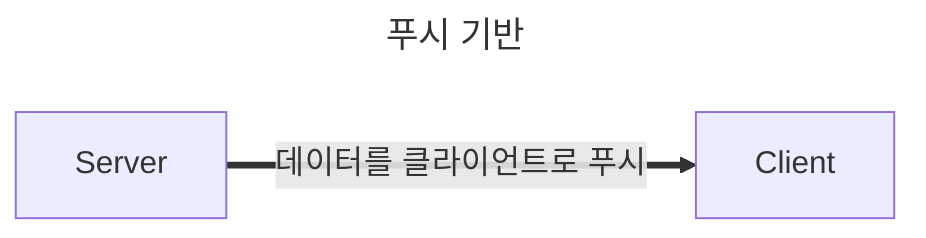
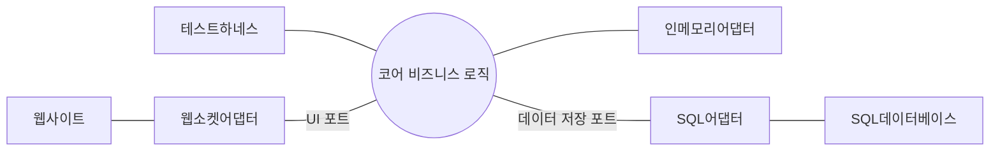

# chapter6 트우터

### 트우터 요구 사항

- 고유의 사용자 ID와 비빌번호로 트우터에 로그인한다.
- 각 사용자는 자신이 팔로우하는 사용자 집합을 갖는다.
- 사용자는 트웃을 전송할 수 있으며 로그인한 모든 팔로워는 이 트웃을 바로 볼 수 있다.
- 사용자가 로그인하면 최종 로그인한 이후로 게시된 팔로워의 모든 트웃을 볼 수 있다.
- 자신의 트웃을 삭제할 수 있다. 팔로워는 삭제된 트웃을 볼 수 없다
- 사용자는 모바일이나 웹사이트로 로그인할 수 있다.

### 설계 개요

트우트는 즉시 볼 수 있는 기능이 이 시스템에 핵심입니다.  
사용자 인터페이스는 서버로 트웃을 전송할 뿐만 아니라 서버로부터 트웃을 받을 수 있어야 합니다.

푸시 기반 모델(`push-based model`)은 작성자가 방출한 이벤트 스트림을 여러 구독자가 수신한다.   
따라서 이 모델은 일대일 통신뿐만 아니라 일대다 통신도 지원합니다.

트우터에서는 트웃의 스트림이 주를 이루므로 이벤트 주도 통신 형식이 적합합니다. 
이벤트 주도 형식에서는 다른 사용자를 팔로우, 즉 이벤트를 구독하면 사용자가 구독 관심 트웃을 서버가 클라이언트로 푸시합니다.

### 이벤트에서 설계까지

**통신**
- 웹소켓
- 큐 서비스
- 메시지 큐

만약 위에 기술들 중 하나를 선택 했지만 추후에 선택한 기술을 바꾸지 못 한다면 좋은 아키텍처 결정이 아닙니다.

**GUI(`UI`)**  
UI를 서버의 비즈니스 로직과 결합을 하면 몇 가지 단점이 생깁니다.
- 테스트를 하기 어렵습니다.
- 단일 책임 원칙을 어깁니다.

이 때문에 코어 비즈니스 로직과 메시징은 분리하여 추상화해야 합니다.

**영구 저장(`데이터베이스`)**  
트우터의 수신한 데이터를 다음과 같은 저장소에 저장 할 수 있습니다.
- 직접 인덱스하고 검색할 수 있는 일반 텍스트 파일
- 전통적 SQL 데이터베이스(`RDBMS`)
- NoSQL 데이터베이스

소프트웨어 프로젝트를 시작하는 단계에서 기술의 적합도를 따지지만 시간이 지나고 나서 요구 사항에 맞는 기술을 변경하려면 응용프로그램과 저장소를 결합을 해야 설계로부터 자유롭습니다.

**육각형 아키텍처(`Hexagonal`)**  
앨리스터 콕번이 정립한 **포트와 어댑터** 또는 **육각형 아키텍처**라 불리는 일반화된 아키텍처를 적용합니다.    
이 아키텍처는 응용프로그램의 코어는 우리가 구현하는 비즈니스 로직이고, 다양한 구현은 코어 로직으로부터 분리되어 있습니다.
코어 비즈니스 로직과 분리하려는 특정 기술이 있다면 **포트(port)** 를 이용합니다.  
외부 이벤트를 통해 코어 비즈니스으로 전달합니다.
**어댑터(`adapter`)** 는 포트로 연결하려는 특정 기술을 이용한 구현 코드입니다.

이 아키텍처를 이용하려면 포트와 어댑터를 추상화해야 한다.  
어떤 기능을 포트로 지정하고 어떤 기능을 코어 도메인으로 분리를 한다.   
극단적으로 코어 도메인 기능을 추상화 하고 수백개 또는 수천개 포트를 지정에서 사용할 수 있다.

비즈니스 문제를 해결하는 데 꼭 필요한 기능을 응용프로그램의 코어로 분류하고 나머지 특정 기능에 종속된 기능이나 통신 관련 기능은 코어 응용프로그램의 외부 세계로 분류하는 것이 일반적이다.
